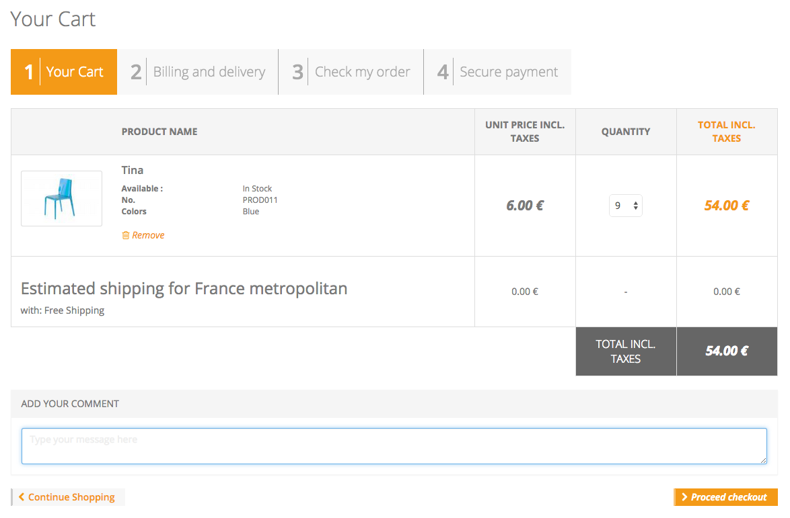

# OrderComment

This module allows your customers to write a comment for an order. Then you can find this comment in the order detail page of the backoffice.



## Installation

### Manually

* Copy the module into ```<thelia_root>/local/modules/``` directory and be sure that the name of the module is OrderComment.
* Activate it in your thelia administration panel

### Composer

Add it in your main thelia composer.json file

```
composer require thelia/order-comment-module:~1.0
```

## Usage

To use this module, you have to include a new form into the ```cart.html``` template like this :

```
{form name="order.comment.form"}
    <form id="order-comment-form" action="{url path='/ordercomment/set/comment'}" method="post">
        {form_hidden_fields form=$form}
        <div class="panel panel-default">
            <div class="panel-heading">
                {intl l="Add your comment" d="ordercomment"}
            </div>
            <div class="panel-body">
                {if $form_error}<div class="alert alert-danger">{$form_error_message}</div>{/if}
                <div id="alert-comment"></div>
                {form_field form=$form field='comment'}
                    <textarea class="form-control" name="{$name}" placeholder="{intl l='Type your message here' d='ordercomment'}">{loop type="order.comment.session.comment" name="session-order-comment" }{ifloop rel="session-order-comment"}{$ORDER_COMMENT}{/ifloop}{/loop}</textarea>
                {/form_field}
            </div>
        </div>

        <a href="{navigate to="index"}" role="button" class="btn btn-continue-shopping"><span>{intl l="Continue Shopping"}</span></a>
        <button type="submit" class="btn btn-checkout">{intl l="Proceed checkout"}</button>
    </form>
{/form}
```

**Take care to replace the link "Proceed checkout" by a submit type button**

And that's it !

## Loop

OrderCommentLoop : order.comment.comment

This loop return the comment of an order.

### Input arguments

|Argument |Description |
|---      |--- |
|**order_id** | Unique ID of the order (eg. order_id=5) |

### Output arguments

|Variable   |Description |
|---        |--- |
|$ORDER_COMMENT    | Content of the comment |

### Example

```
{ifloop rel="order_comment_loop"}
    {loop name="order_comment_loop" type="order.comment.comment" order_id="$order_id" }
        {$ORDER_COMMENT}
    {/loop}
{/ifloop}
{elseloop rel="order_comment_loop"}
    <p class="alert alert-warning">
        {intl l="No comment for this order was defined." d="ordercomment"}
    </p>
{/elseloop}
```

## Other ?

It may be convenient to display the comment on the detail page of the customer's order.
To do that, uses the loop described previously.